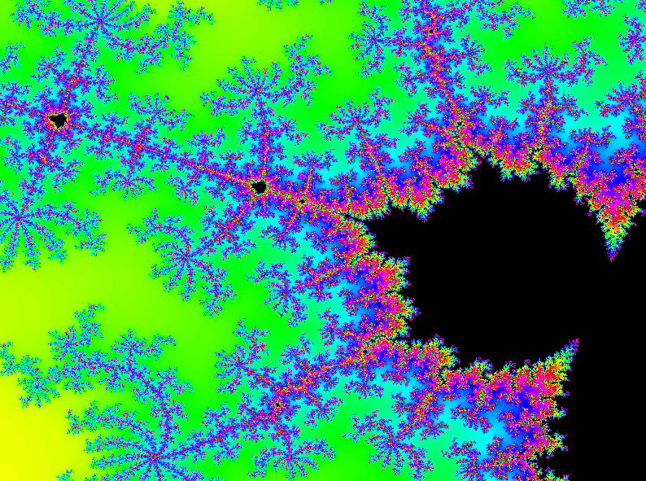

# Multi-threaded Mandelbrot Renderer

A University project from 2015 to learn multithreading concepts.

## Controls

Use the `arrow keys` to navigate the Mandelbrot.  
Use the plus and minus keys (`+`, `-`) on the top row to zoom in / out.  

`M` to mix 100 random lines of the Mandelbrot.
`S` to preform std::shuffle on the lines of the Mandelbrot.
`B` to reorder the Mandelbrot using bubble sort.
`R` redraws the image and prints the time taken to the console.
`C` clears all tasks in the queue.

Press `1` - `8` on the top row to change the number of threads used.

Press `1` - `4` on the numpad to change the dispersion of the lines as they are drawn.

## Building

Depends on a C++11 compiler and [SDL2](https://www.libsdl.org/download-2.0.php).

Install SDL2 on Mac with `brew install sdl2`.

Build with `make`.